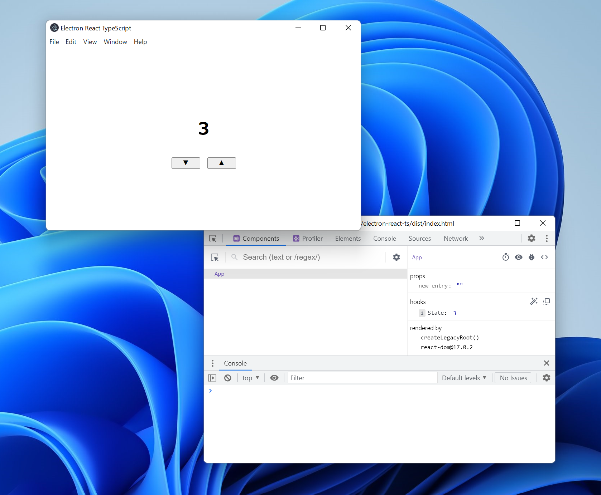

# electron-react-ts

An [Electron](https://www.electronjs.org/) boilerplate with hot reloading for [React](https://reactjs.org/) and [TypeScript](https://www.typescriptlang.org/).




## :green_book: Usage

```sh
$ git clone https://github.com/sprout2000/electron-react-ts.git
$ cd electron-react-ts
$ yarn install

# on development
$ yarn dev

# on release build
$ yarn build
```

## :copyright: License

Copyright (c) 2021 sprout2000
